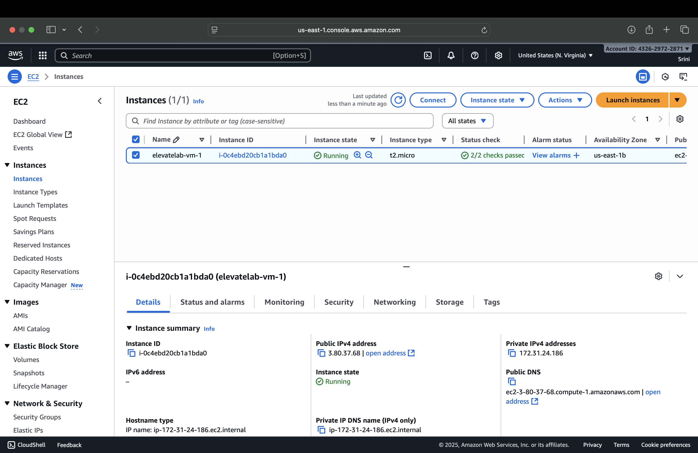
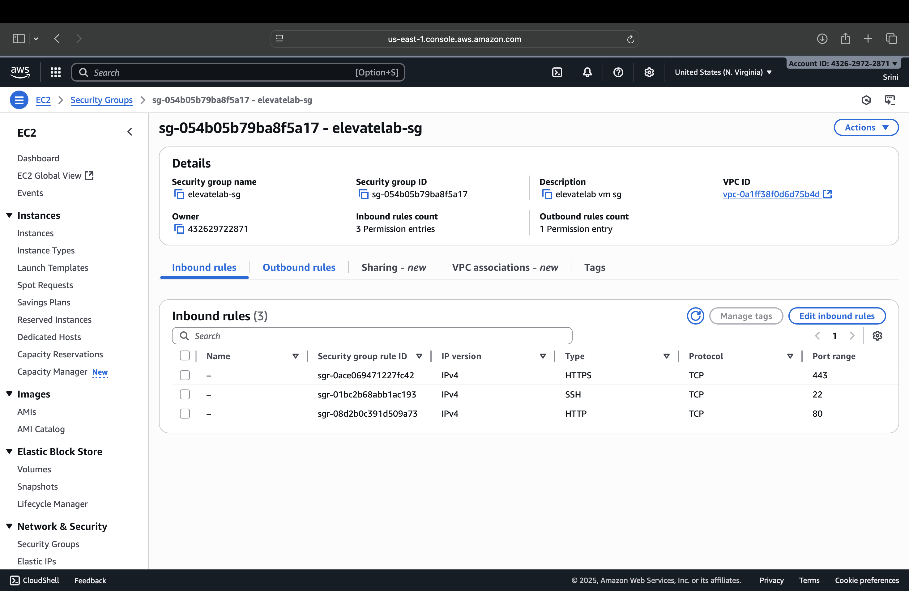
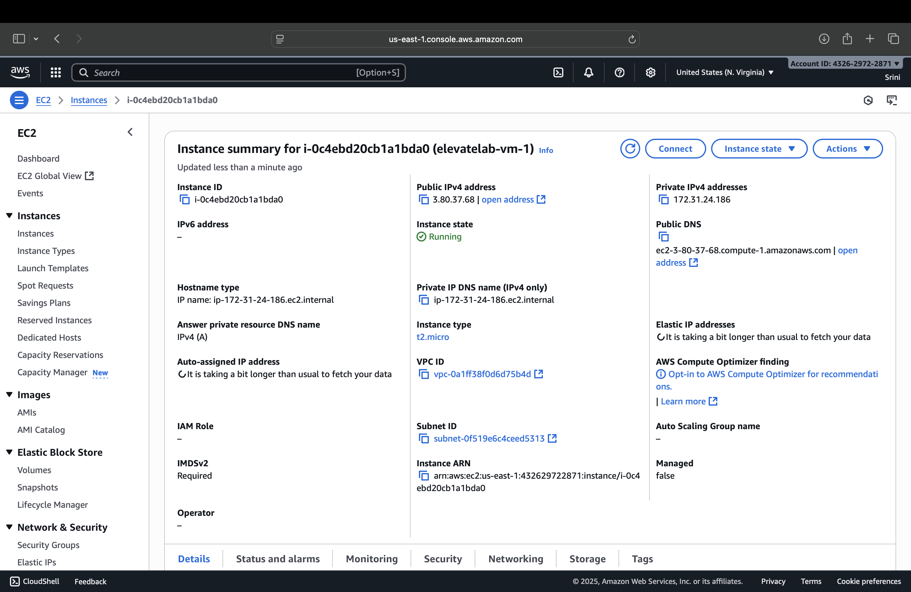
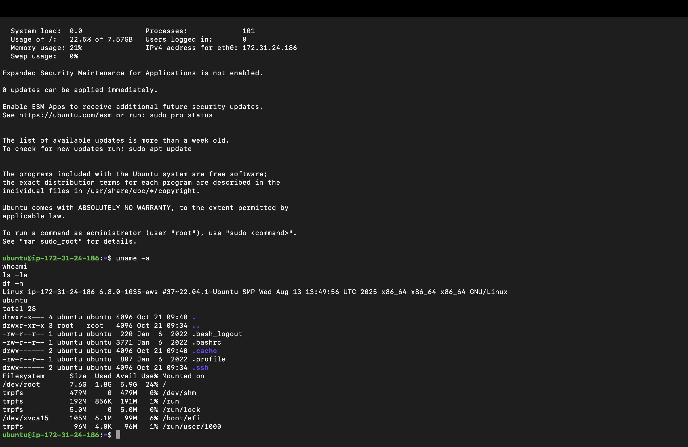

# ☁️ AWS EC2 – Launch a Virtual Machine (ElevateLab Task 2)

## Objective
To understand **how cloud virtual machines work** by creating, configuring, and connecting to a **cloud-based Ubuntu instance** on AWS EC2.  
This task helps beginners grasp **Infrastructure as a Service (IaaS)** — the foundation of cloud infrastructure.

---

## Tools Used
- **AWS EC2 (Free Tier)**
- **Ubuntu 22.04 LTS**
- **SSH (Secure Shell)** for terminal access
- **AWS Management Console**

---

## Deliverables
- Screenshot of **Security Group configuration**
- Screenshot of **EC2 instance (running)**
- Screenshot of **SSH terminal connection**
- Screenshot showing **Linux system info**

---

## Step-by-Step Guide

### Create and Configure EC2 Instance
1. Log in to your AWS account.
2. Go to **EC2 → Launch Instance**.
3. Name your instance: `elevatelab-vm-1`.
4. Choose OS: **Ubuntu 22.04 LTS (Free Tier eligible)**.
5. Choose instance type: **t2.micro**.
6. Create a **new key pair**:
   - Name: `elevatelab-key`
   - Type: `.pem`
   - Download and keep it safe.
7. Click **Next: Network Settings**.

 **Screenshot:**  


---

### Configure Security Group (Firewall)
- Create a **new Security Group** named `elevatelab-sg`.
- Add the following inbound rules:

| Type | Protocol | Port Range | Source |
|------|-----------|-------------|---------|
| SSH | TCP | 22 | My IP or Anywhere |
| HTTP | TCP | 80 | Anywhere |
| HTTPS | TCP | 443 | Anywhere |

 **Screenshot:**  


---

### Launch the Instance
- Click **Launch Instance**.
- Wait for the status to change to **Running**.
- Copy your **Public IPv4 address** from the instance details.

 **Screenshot:**  


---

### Connect to EC2 via SSH
1. Open your system terminal or PowerShell.
2. Navigate to the folder containing your `.pem` file.
3. Run the commands:

```bash
chmod 400 elevatelab-key.pem
ssh -i elevatelab-key.pem ubuntu@<Your-Public-IP>
```

 **Screenshot:**  


---

### Verify System Details (Ubuntu)
 - Run these commands after logging in:

```
uname -a      # Display system info
whoami        # Show current user
ls -la        # List files in home directory
df -h         # Disk space usage
```

 **Screenshot:** 
 
